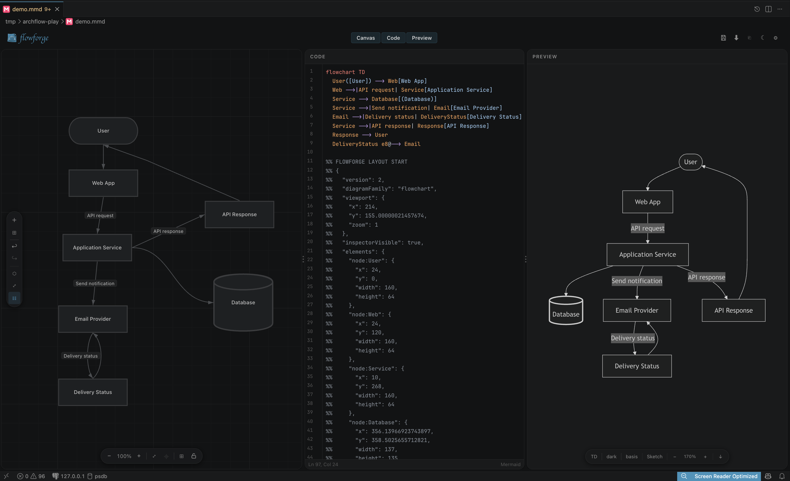
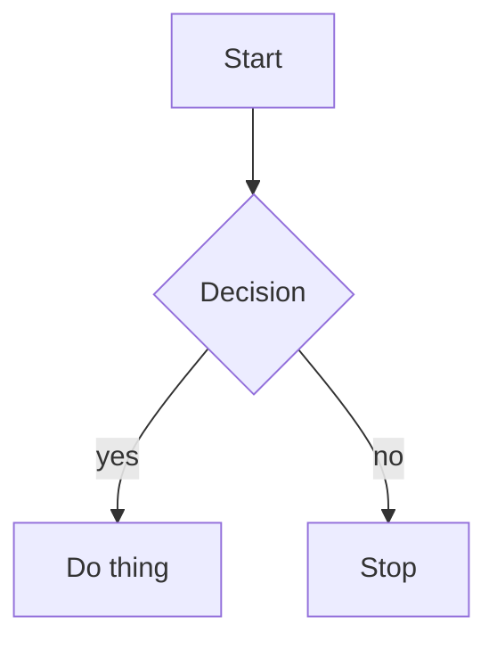

<div align="center">


</div>

## What is Flowforge?

Flowforge is a visual [Mermaid.js](https://mermaid.js.org) editor for VS Code that keeps `.mmd` files portable, Git-friendly, and AI-readable. It registers a custom editor for `.mmd` files, so opening one drops you straight into a three-pane workspace: drag nodes, connect edges, configure layouts, and the Mermaid source stays in perfect sync.

In the age of AI-assisted development, having a **clear, crystalized visual blueprint** of your system is valuable. LLMs work best with structured, precise context — not vague descriptions. Flowforge bridges human visual thinking and machine-readable system models.

> Draw your system. Export the blueprint. Feed it to your AI.

<div align="center">
  
  <br />
  <sub>Canvas, Code, and live Preview — all in one VS Code editor, kept in sync.</sub>
</div>

## How It Works

Open any `.mmd` file in VS Code and Flowforge takes over as the editor. Three synchronized views work on the same diagram:

- Edit a node on the **Canvas** → the Mermaid source in **Code** updates instantly.
- Type Mermaid syntax in **Code** → the **Canvas** and **Preview** re-render.
- The file on disk stays a plain `.mmd` — fully portable, git-friendly, and readable by any other Mermaid tool.

Node positions and viewport state are persisted as an `FLOWFORGE LAYOUT` Mermaid comment block inside the `.mmd` file, so the diagram stays portable as one file and remains easy for LLMs to inspect or edit.

## Features

### Three Views, One Editor

| View | Description |
|------|-------------|
| **Code** | Full syntax editor with Mermaid highlighting (CodeMirror 6) |
| **Preview** | Live rendered diagram with theme and curve controls |
| **Canvas** | Infinite drag-and-drop canvas — Miro-style visual editing |

### Canvas Editing
- Drag nodes from the sidebar onto the canvas
- Connect nodes via directional handles (top / bottom / left / right)
- 14 node shapes — Rectangle, Rounded, Diamond, Stadium, Circle, Hexagon, Cylinder, and more
- Inline label editing — double-click any node or edge
- Undo / Redo with full history stack

### Diagram Controls
- Layout direction — Top-to-Bottom, Left-to-Right, Bottom-to-Top, Right-to-Left
- Mermaid themes — default, dark, forest, neutral, base
- Hand-drawn (sketch) mode toggle
- 12 curve routing styles
- Auto-layout powered by Dagre

### Import & Export
- Edit `.mmd` Mermaid files directly — no import step
- Export Mermaid `.mmd` files and copy Mermaid source
- Copy Mermaid syntax to clipboard in one click

### VS Code Integration
- Respects your VS Code dark / light theme automatically
- Auto-save with debounce (toggle via the `flowforge.autoSave` setting)
- Command palette actions and configurable keybindings
- Inspector panel — click any node to edit its properties
- External file-change detection — edits made outside the editor are picked up

## Roadmap

These were planned but not built. Up for grabs if you fork:

- [ ] Subgraph support
- [ ] Sequence / class / ER / state diagram support
- [ ] Mindmap support
- [ ] Split-insert — drag a node onto a connection to insert it between
- [ ] Custom theme editor
- [ ] AI-assisted diagram generation

## Tech Stack

| Layer | Choice |
|-------|--------|
| Host | VS Code Custom Editor API (`.mmd` files) |
| Webview UI | React 19 |
| Visual Canvas | React Flow ([XY Flow](https://reactflow.dev)) |
| Code Editor | CodeMirror 6 |
| Mermaid Render | mermaid.js 11 |
| State | Zustand |
| Layout | Dagre |
| Language | TypeScript 5 |
| Build | esbuild (extension host) + Vite (webview) |

## Development

```bash
git clone https://github.com/SauliusDev/flowforge.git
cd flowforge
npm install
```

Then press **F5** in VS Code (Run → Start Debugging → *Run Flowforge Extension (Dev / HMR)*). This launches an **Extension Development Host** window with Flowforge loaded and hot-reload running. Open any `.mmd` file in that window to start editing.

No `.mmd` file handy? Create one:



### Scripts

```bash
npm run dev               # esbuild watch + Vite dev server (auto-run by F5)
npm run build             # production build
npm run lint              # ESLint
npm run test:webview      # React/Vitest unit tests (components, store, parsers)
npm run test:unit         # extension-host unit tests (jest-mock-vscode)
```

**Requirements:** Node.js 18+ and VS Code 1.80+.

## Contributing

Flowforge is actively developed and MIT-licensed. Contributions, feedback, issues, and pull requests are very welcome — with the community's help, we aim to make it the best visual diagram editor for developers.

The codebase follows strict TypeScript with 2-space indentation and single quotes. Webview React code lives in `src/webview/`, extension-host code in `src/extension/`. Tests are co-located next to source files.

## License

Flowforge is licensed under the **[MIT License](LICENSE)** — use it, fork it, embed it, sell it. No restrictions beyond keeping the copyright notice.

## 🙏 Attribution

Flowforge is built on the shoulders of two open-source projects:

- **[mermaid-visual-editor](https://github.com/saketkattu/mermaid-visual-editor)** by [@saketkattu](https://github.com/saketkattu) — the original visual drag-and-drop Mermaid editor that Flowforge was forked from
- **[mermaid-reactflow-editor](https://github.com/albingcj/mermaid-reactflow-editor)** by [@albingcj](https://github.com/albingcj) — inspiration and code for the React Flow canvas and Mermaid-to-canvas conversion approach

<div align="center">
  <sub>⭐ If this project helps you, please give it a <a href="https://github.com/SauliusDev/flowforge">Star!</a></sub>
</div>
